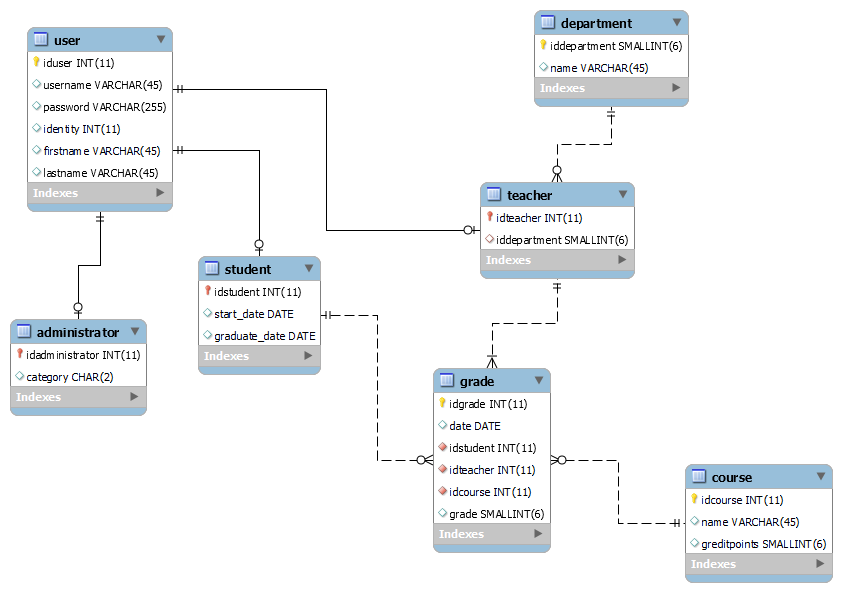
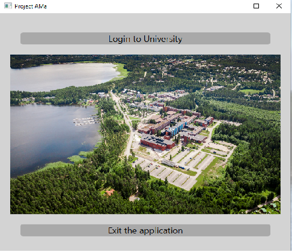
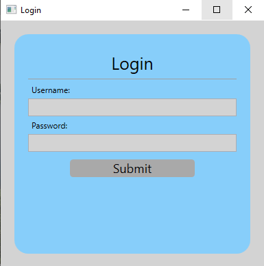
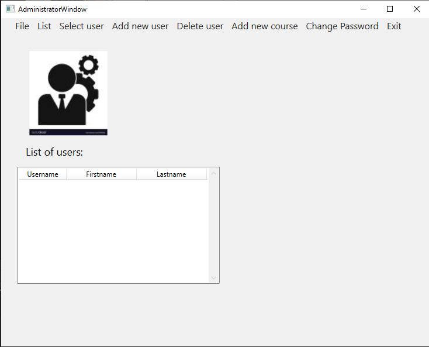
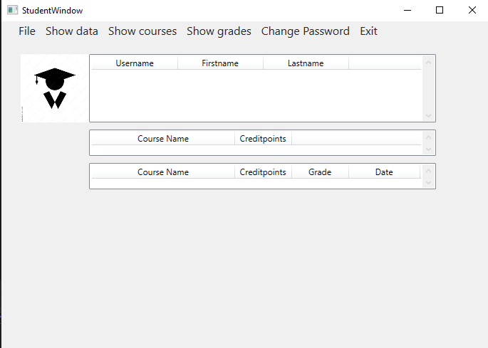
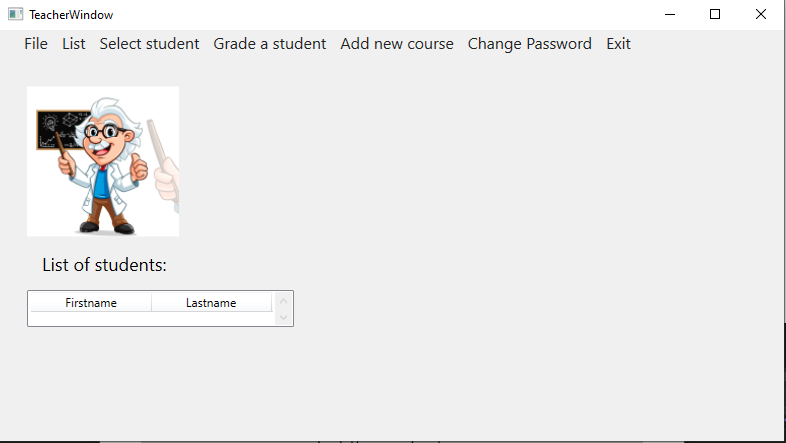

<h1> WPF user interface </h1>
 
This application is a WPF-interface to interact with the MySQL university-database. Database is located on a separate computer running Fedora Server. Data is read synchronously using Dapper ORM. 
  
<h2>ER-model</h2>

 
<h2>Application</h2>
 
The application opens with a main window directing user to either a login screen or to exit the application. 
  

User authorization is done by comparing user inputted credentials with the data stored in the database. After successful authorization user is directed to an appropriate window based on user category, i.e. administratror, student of teacher. Each user category then can carry out operations that are allowed for the category, administrator-category having the largest rights.
 

  

 
Administrator can in the current version view user information and add/delete users. Administrator can also create a new course as well as change his/her own password. User information is output using ListView, thus user can be selected from the desired list by clicking. Update operations are at the moment under construction.
 

 
Student can at the moment view his/her own data in a limited fashion, as well as view courses and grades he/she has enrolled in. Changing of password is also possible.
 

 
Teacher has at the moment possibility to view limited student data and add a new course. Changing of password is also possible.
 

Upon exiting the user window, application returns to the start window where user can either log in again or close the application.
 
The application should be converted to the MVVM-model in the future.
